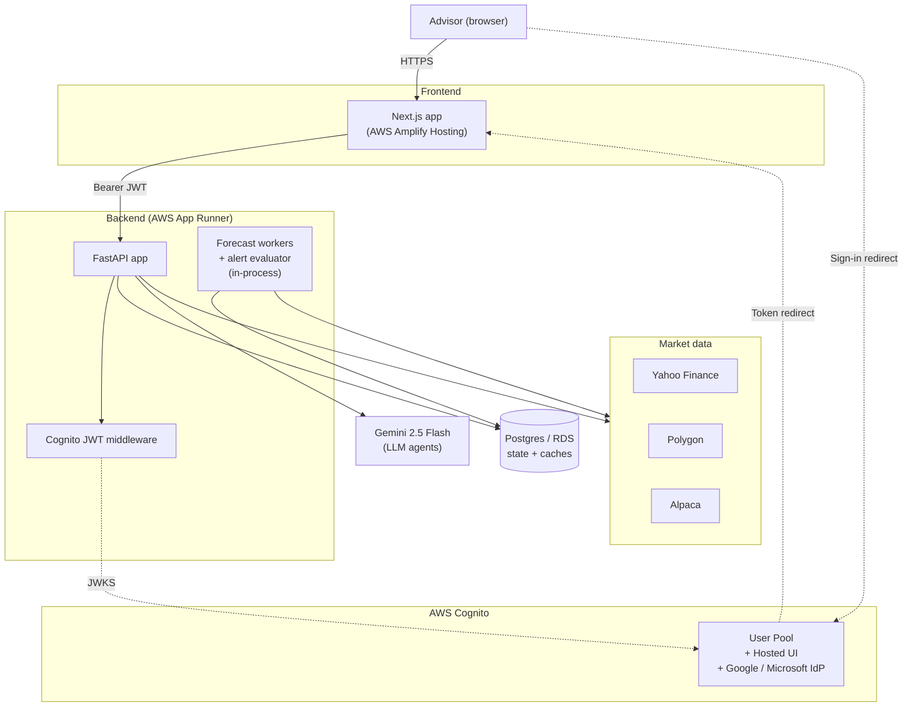

# Qmetrum Architecture

This document describes how the running system is structured. For a higher-
level "what is this product" overview see [`README.md`](./README.md).

---

## 1. System context



**Service boundaries today**:

- **Frontend** (`services/frontend_nextjs`) — separately deployable, talks only to the backend over REST.
- **Backend** (`services/forecasting_service_py`) — single FastAPI app. ~70 endpoints. Single Postgres. Holds all business logic, ML/quant code, AI agents, and PDF generation.
- **Risk service (R)** is archived (`archive/backend_unused/...`) — its functionality has been re-implemented in Python.

We deliberately stay monolithic on the backend until a real reason emerges to split. See the [scaling note](#7-scaling-and-future-splits) below.

---

## 2. Backend layout

```
app/
├── main.py                # FastAPI app + ~70 route handlers
├── auth/                  # Cognito JWT validation + middleware
│   ├── cognito.py         # JWKS cache, JWT verify, find-or-create User
│   ├── middleware.py      # CognitoAuthMiddleware (rewrites X-User-Id from JWT)
│   └── router.py          # GET /auth/me
├── agents/                # AI agents (Gemini)
│   ├── llm.py             # Generic Gemini wrapper + agentrun caching
│   ├── disclaimer.py
│   ├── portfolio_commentary.py
│   ├── scenario_translator.py
│   ├── scenario_summary.py
│   ├── news_synthesizer.py
│   ├── alert_explainer.py
│   ├── client_qa.py
│   └── agents_router.py
├── db/
│   ├── database.py        # SQLAlchemy engine factory (sqlite/postgres-aware)
│   └── models.py          # SQLModel tables (~25 tables)
├── logic/                 # Forecasting + risk + regime + quantum
│   ├── forecasting_logic.py     # HybridForecaster (ARIMA, BSTS, GARCH, indicators)
│   ├── portfolio_logic.py       # PortfolioManager (orchestrates per-portfolio analysis)
│   ├── forecast_extensions.py   # Drawdown, monthly returns, etc.
│   ├── regime.py                # Per-asset-class regime threshold lookup (DB-backed)
│   ├── tensor_network_risk.py   # MPS-copula joint return sampling
│   ├── vqmc_scenarios.py        # VQMC scenario fans (used in default flow)
│   ├── quantum_vqmc_trained.py  # VQMC training (behind /simulate_quantum_risk)
│   ├── quantum_iae_risk.py      # Quantum amplitude estimation for VaR/CVaR
│   ├── quantum_kernel.py        # Q-SVM regime classification
│   ├── quantum_reservoir.py     # QRC-based forecaster (in ensemble)
│   ├── quantum_portfolio_opt.py # Quantum mean-variance optimization
│   ├── quantum_entropy.py       # Systemic-risk entropy report
│   ├── quantum_backend.py       # Qiskit backend selection helpers
│   ├── adversarial_discovery.py # Adversarial scenario synthesis
│   └── pdf_mps.py               # 1D PDF → MPS encoder (per Bohun et al. PRR 2026)
├── reports/               # PDF templates (reportlab + matplotlib)
│   └── report_router.py
├── services/              # External-system clients
│   ├── market_store.py    # Cached price / fundamentals / news fetcher
│   ├── risk_client.py     # (legacy) HTTP client for the archived R service
│   └── runtime_hardening.py
├── vendors/               # Market-data vendor abstraction
│   ├── base.py            # MarketDataVendor Protocol
│   ├── yahoo.py
│   ├── polygon.py
│   ├── alpaca.py          # REST only (no streaming)
│   ├── hybrid.py          # Per-call router: prices/news/snapshot via Alpaca, fundamentals via Yahoo
│   └── __init__.py        # get_vendor() registry
├── workers/               # Background forecast job runner
└── data/                  # Bundled JSON seeds (regime threshold defaults)
```

---

## 3. Request flow

For an authenticated request:

1. **Browser** sends `GET /portfolios/123` with `Authorization: Bearer <id_token>`.
2. **`CognitoAuthMiddleware`** extracts the token, verifies signature against the User Pool's JWKS (cached, refreshed hourly), checks issuer + audience + expiry. On success, looks up (or creates) a local `User` row by `cognito_sub` and rewrites the `X-User-Id` header on the request scope to that row's id.
3. **Endpoint handler** reads `X-User-Id` via FastAPI's `Header(...)` resolver, calls `_require_user()` → returns the `User`, scopes the query to that user.
4. **Response** is returned — JSON with portfolio + holdings.

If `Authorization` is absent and `COGNITO_USER_POOL_ID` is unset (local-dev mode), the legacy `X-User-Id` path still works — the frontend's axios interceptor sends `X-User-Id: 1` by default. Once Cognito is configured, the legacy path is bypassed for any request that includes a valid Bearer.

For an LLM agent endpoint (e.g., `POST /agents/commentary/{portfolio_id}`), the same auth happens, then:

1. The handler loads portfolio + holdings + caller-supplied metrics.
2. `agents.portfolio_commentary.run(...)` builds a prompt and calls `agents.llm.generate(...)`.
3. `llm.generate` computes a content hash of `(agent_name, model, prompt, cache_key_extra)` and checks the `agentrun` table for a cached identical run.
4. On cache hit: return the cached output. On miss: call Gemini, persist a row in `agentrun` with input hash + output + token counts + latency, return the result.
5. Output is wrapped in the standard disclaimer footer.
6. Response includes the structured `source_data` the LLM was given so the frontend can render a "View source data" panel.

---

## 4. Database

PostgreSQL in prod, SQLite in dev. Same SQLModel schema, ~25 tables. Highlights:

| Table | Purpose |
|---|---|
| `user` | One row per user; `email` + `cognito_sub` (unique) link to Cognito. |
| `portfolio` + `position` | Client portfolios and their holdings. |
| `asset` | Reference data (tickers we know about). |
| `watchlist` + `watchlistitem` | Saved tickers; the `__saved_assets__` watchlist is a special per-user one used by the "★ Save Asset" button. |
| `alertrule` + `alertevent` | Per-ticker price thresholds and their triggered evaluations. |
| `savedscreen` | Stored screener filter sets. |
| `forecastcache`, `portfolioforecastcache`, `assetriskcache`, `assetvolatilitysnapshot`, `newscache`, `intradayquote`, `benchmarkreturn`, `assetreturn`, `portfolioreportdatacache`, `risksimulationcache` | Various caching tables — most are indexed by an input-hash + entity key, refreshed lazily. |
| `regimethreshold` | Per-asset-class regime thresholds (calibrated by `scripts/calibrate_regime_thresholds.py`). The runtime regime classifier reads the latest active row per class. |
| `agentrun` | Audit + cache log of every Gemini agent call (prompt hash, output, tokens, latency, status). |
| `forecastjob` | Async forecast job queue (background worker pool). |

Migrations live in `services/forecasting_service_py/alembic/versions/` and are written to be **dialect-portable** (SQLite + Postgres). Boolean defaults use `sa.true()` / `sa.false()` rather than `sa.text("1")`.

---

## 5. AI agent layer

All agents share `app/agents/llm.py` — a thin wrapper over Google's `google-genai` SDK that:

- Defaults to `gemini-2.5-flash` (cheap, fast).
- Accepts an optional Pydantic schema for structured output (used by the scenario translator and news synthesizer).
- Hashes inputs and looks up `agentrun` to short-circuit duplicate calls.
- Logs every call (prompt tokens, output tokens, latency, status, error) to `agentrun` for both observability and cost tracking.

Each agent module is a **pure prompt builder + dataclass output**. They never reach over the LLM — facts are always sourced from our DB. The frontend renders a collapsible "View source data" panel beneath every agent response so advisors can verify claims against the underlying numbers.

Six agents currently:

| Agent | Endpoint | Where in UI |
|---|---|---|
| Portfolio commentary | `POST /agents/commentary/{portfolio_id}` | Card on `/portfolios/[id]` |
| Scenario translator | `POST /agents/scenario-translate` | NL input on `/scenarios` (auto-fills sliders + adds to active list) |
| Scenario summary | `POST /agents/scenario-summary` | Card on `/scenarios` after a run |
| News synthesizer | `POST /agents/news-synthesize/{ticker}` | Card on Asset detail → News tab |
| Alert explainer | `POST /agents/alert-explain/{alert_id}` | Per-alert "Explain" button in `AlertRulesList` |
| Client Q&A | `POST /agents/qa/{portfolio_id}` | "Ask Advisor" drawer on `/portfolios/[id]` (single-turn) |

---

## 6. Quantum / quantum-inspired stack

Two tiers:

**On the user-feature path** — runs in every relevant request:

- **`tensor_network_risk` (MPS-copula)** — fits a Matrix Product State to discretized historical joint returns; samples scenarios that capture non-Gaussian cross-asset dependence. Used in `portfolio_logic.PortfolioManager.analyze_portfolio` to produce the joint scenario fans on `/scenarios`.
- **`vqmc_scenarios` (VQMC fans)** — generates per-asset distributional scenario paths via a trained variational quantum circuit (or classical fallback). Output is the Price Path Distribution chart on the Asset detail page.
- **`quantum_reservoir` (QRC)** — one of the ensemble members in `HybridForecaster`. A nonlinear-feature mapping inspired by reservoir computing, executed as a small parameterized quantum circuit.

**Behind dedicated endpoints** — exposed but not (yet) wired to the UI:

- `simulate_quantum_risk` (`simulate_trained_vqmc`, `quantum_iae_risk`)
- `quantum_rebalance` (`quantum_portfolio_opt`)
- `quantum_regime` (`quantum_kernel` / Q-SVM)
- `quantum_systemic_risk` (`quantum_entropy`)
- `tensor_network_risk` (the standalone-endpoint variant)
- `quantum/train_ansatz`, `quantum/qrc/*`

These are research-grade. Status is acknowledged in the README.

**Newer addition**: `app/logic/pdf_mps.py` implements a 1D PDF → MPS encoder following Bohun et al., *Phys. Rev. Research* 8, 023062 (2026). Standalone utility, not yet wired into VQMC.

---

## 7. Scaling and future splits

Current architecture is a deliberate monolith (one FastAPI service + one Postgres). Reasons not to split yet:

- Single team, single language, single request profile.
- Splitting adds network hops, deploy complexity, schema-coordination overhead — none of which buys us anything pre-customer.

Future splits we'd consider, in order of likelihood:

1. **Forecast workers as a separate service** — long-running forecast jobs are CPU-heavy and currently run in-process via a thread pool. Moving them to a separate worker pool (still same code, just different deployment) is a low-friction win when traffic warrants it.
2. **Background alert evaluator as a separate scheduled job** — currently runs in-process every 5 min. Could become an EventBridge-triggered Lambda or App Runner scheduled task.
3. **Calibration as a scheduled job** — `scripts/calibrate_regime_thresholds.py` should run monthly via Cloud Scheduler / EventBridge instead of being run by hand.

We'd avoid splitting along feature axes (e.g. a separate "agents service", a separate "quantum service") — these would share too much state with the core to pay for themselves.

---

## 8. Frontend layout

```
src/
├── app/                     # Next.js routes
│   ├── auth/callback/       # Cognito redirect target
│   ├── dashboard/
│   ├── assets/
│   ├── portfolios/
│   ├── scenarios/
│   ├── reports/
│   ├── clients/
│   ├── settings/
│   ├── layout.tsx           # Root shell (Sidebar + TopBar + AuthGate around children)
│   └── page.tsx             # /
├── components/
│   ├── auth/                # AuthGate, AuthSync
│   ├── charts/              # Recharts + lightweight-charts wrappers
│   ├── shared/              # AlertRulesList, ScenarioSummaryCard, agent cards, …
│   ├── layout/              # Sidebar, TopBar
│   └── providers/           # AppProviders (AuthProvider + QueryClient + Branding + AuthGate)
└── lib/
    ├── api.ts               # axios instance + per-feature API objects
    ├── auth.ts              # OIDC config + Cognito Hosted UI logout helper
    ├── candlesticks.ts      # OHLC aggregation utility
    ├── csv.ts / png.ts      # Chart-export helpers
    └── savedAssets.ts       # React Query hook for the saved-assets watchlist
```

State management: TanStack Query for server state, plain `useState` for component-local state. No Redux. The `AuthSync` component mirrors the OIDC user's `id_token` into the axios module so every API call carries the bearer; on user change it clears the React Query cache to avoid cross-tenant leakage.

---

## 9. Caching & background work

- **Forecast caches** (`forecastcache`, `portfolioforecastcache`, `assetriskcache`) are content-hashed on input parameters; identical re-runs are free.
- **Agent runs** (`agentrun`) are content-hashed on `(agent_name, model, prompt, cache_key_extra)`; identical inputs return instantly.
- **JWKS cache** (in `app/auth/cognito.py`) refreshes hourly — invalidated on first kid-miss to handle key rotation.
- **Alert scheduler** runs in-process every 5 minutes (configurable), evaluates active alerts, persists `AlertEvent` rows.
- **Forecast jobs** are dispatched via a thread pool today (`app/workers/`); the design supports moving to an external queue later.

---

## 10. Configuration

All runtime config is environment-driven:

- **Backend**: `services/forecasting_service_py/.env.example` documents every required env var (DB URL, Cognito, Gemini, vendor keys).
- **Frontend**: `services/frontend_nextjs/.env.local.example` for `NEXT_PUBLIC_*` build-time vars.
- **Production**: env vars come from AWS Secrets Manager / SSM Parameter Store, injected by App Runner / Amplify at deploy time.

Per-asset-class regime thresholds are stored in the `regimethreshold` DB table (was originally a JSON file, kept as a one-time seed in `app/data/regime_thresholds.json`). The calibration script does INSERT-then-deactivate-prior to preserve history.
